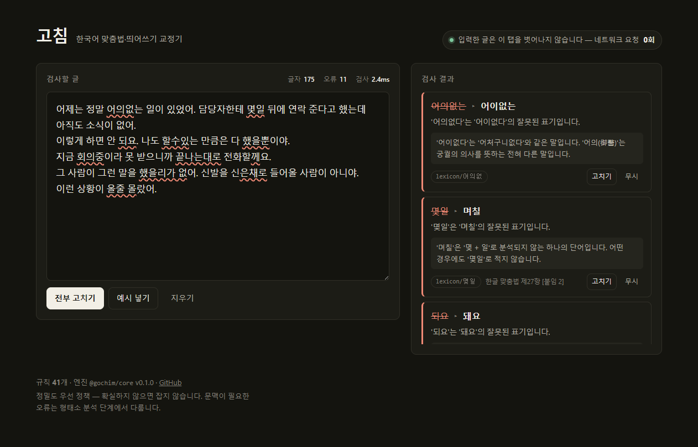

<div align="center">

# 고침 · Gochim

**브라우저 안에서만 도는 한국어 맞춤법·띄어쓰기 교정기**

입력한 글이 기기 밖으로 나가지 않습니다. 서버도, API 키도, 네트워크 요청도 없습니다.

</div>



## 왜 만들었나

한국어 교정 도구는 대부분 **글을 서버로 보낸다.** 블로그 글이면 상관없지만
자기소개서, 진단서, 아직 공개하지 않은 원고라면 이야기가 다르다.

고침은 `check(text) → Diagnostic[]` 하나짜리 순수 함수다. 부작용도, 통신도, 전역 상태도 없다.
엔진 전체가 **gzip 18.5 kB**이고 런타임 의존성이 0개다. (절반 이상이 "왜 틀렸는지" 설명 텍스트다)

## 측정값

골든 테스트셋(오류 문장 132개 · **정상 문장 297개**)에 대한 실측입니다.
정상 문장 297개 중 165개는 "순진한 규칙이 오탐할 문장"만 골라 따로 만든 함정입니다.

| | |
| --- | --- |
| **정밀도** | **1.000** (오탐 0건 / 정상 문장 297개) |
| 재현율 | 0.849 (오류 구간 132개 중 112개 검출) |
| 규칙 | 41개 (예시 202개, 반례 96개가 테스트로 강제됨) |
| 테스트 | 423개 |
| 검사 속도 | 2,150자 **0.58ms** |
| 번들 | minified 85 kB · **gzip 18.5 kB**, 런타임 의존성 0개 |

```bash
npm run golden:report   # 분류별 검출률 · 오탐 목록 · 아직 못 잡는 오류 목록
```

## 지금 되는 것

```ts
import { check, fix } from '@gochim/core'

fix('몇일 뒤에 할수있어.')
// '며칠 뒤에 할 수 있어.'
```

- **맞춤법** — `됬어→됐어`, `어의없다→어이없다`, `않되요→안 돼요`, 사이시옷, `-이/-히`
- **띄어쓰기** — 의존명사 `수·것·거·뿐·리·줄·채·바·김·때문·적·중` 등, 조사·어미 붙여쓰기(`너 뿐만→너뿐만`, `할 지→할지`)
- **어미·서술격** — `할께요→할게요`, `뭐에요→뭐예요`, `했슴→했음`
- **받침으로 푸는 규칙** — `경쟁율→경쟁률`(두음법칙), `년도별→연도별`, `책예요→책이에요`
- 각 진단은 **왜 틀렸는지**와 **한글 맞춤법 조항**을 함께 준다 → [규칙 목록](docs/rules.md)
- URL·이메일·코드·HTML 태그·파일 경로·짧은 인용은 건드리지 않는다

## 지금 안 되는 것 (의도적으로)

문맥 없이는 판정이 불가능한 것들이다. 억지로 잡으면 맞는 문장에 밑줄이 그어진다.

| 포기한 것 | 이유 |
| --- | --- |
| `-ㄴ 지` / `-ㄴ지` | `먹은 지 한 달`과 `범인인지 한 달`이 문자열로 같다 |
| `안되다` / `안 되다` | 둘 다 표준어이고 뜻이 다르다 |
| `한번` / `한 번` | 부사냐 횟수냐에 따라 갈린다 |
| `-을 만큼` | ㄹ받침 체언과 겹친다 (`하늘만큼 땅만큼`) |
| `하던지` / `하든지` | 회상이냐 선택이냐는 문맥이 정한다 |
| `반듯이` / `반드시` | 자세냐 확실함이냐는 문맥이 정한다 |

품사를 알아야 풀리는 문제라, **형태소 분석 층(Phase 1)** 으로 미뤘다.
자세한 근거는 [ADR 0002 — 정밀도 우선](docs/decisions/0002-precision-first.md).

문법 검사, 문체 개선, AI 재작성은 **범위 밖**이다.

## 구조

```
packages/core/     @gochim/core — 엔진. DOM도 크롬 API도 모른다
apps/demo/         웹 데모 (Vite)
data/golden/       골든 테스트셋 — 정확도 판정의 유일한 기준
tools/probe/       garu-ko 브라우저 실측 하네스
docs/decisions/    설계 기록(ADR)
```

판정은 3층으로 쌓는다. 지금은 1층만 구현되어 있다.

| 층 | 방식 | 상태 |
| --- | --- | --- |
| 1층 · 규칙 사전 | 문자열 패턴 + 받침 계산 | ✅ |
| 2층 · 형태소 이상 탐지 | garu-ko 분석 결과 | Phase 1 |
| 3층 · 품사 기반 띄어쓰기 | POS 태그 | Phase 1 |

## 개발

```bash
npm install
npm run dev            # 웹 데모
npm test               # 테스트
npm run golden:report  # 골든 테스트셋 성적표 (정밀도·재현율·미검출 목록)
npm run probe:sync     # garu-ko 실측 하네스 에셋 동기화
```

## 로드맵

- [x] **Phase 0** — 워크스페이스, 골든 테스트셋, 1층 규칙 엔진, 웹 데모
- [ ] **Phase 1** — garu-ko 연동(2·3층), 무시 사전(IndexedDB), 크롬 확장 밑줄 오버레이, `@gochim/core` npm 배포

## 설계 기록

1. [garu-ko를 쓰고 0.9.14에 고정한다](docs/decisions/0001-garu-ko-and-bundle-budget.md)
2. [정밀도를 재현율보다 우선한다](docs/decisions/0002-precision-first.md)
3. [판정은 3층, 저장소는 둘로](docs/decisions/0003-three-layers-and-repo-split.md)
4. [골든 테스트셋을 코드보다 먼저 만든다](docs/decisions/0004-golden-set-first.md)

## 라이선스

MIT
